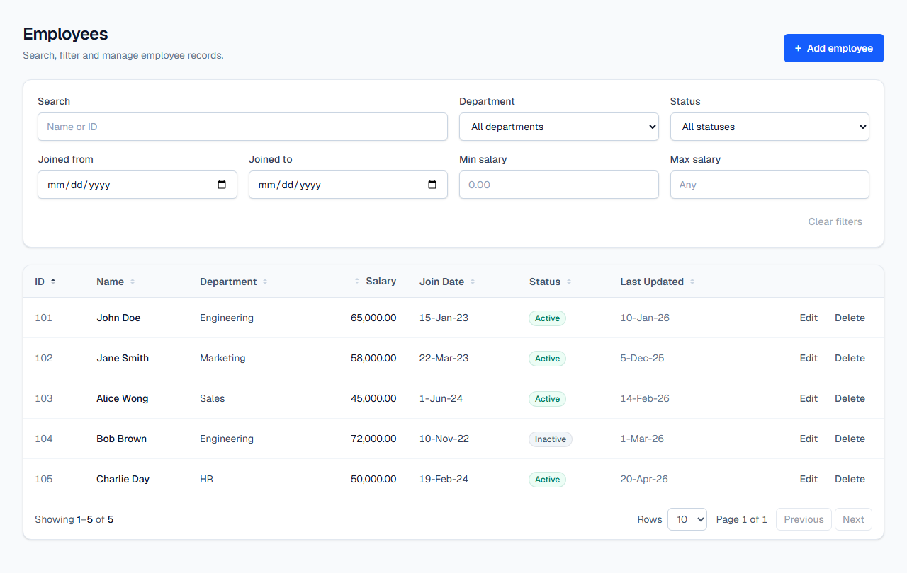
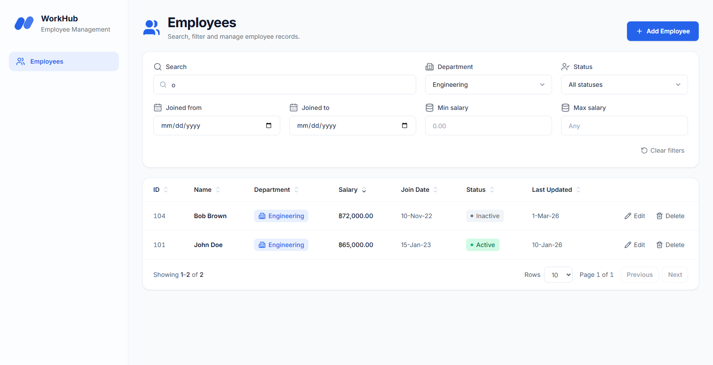

# Employee Management Web

Web UI for managing employee records: a searchable, filterable, sortable table
with add, edit and delete.

Backend: [assignment-employee-management-api](https://github.com/nichapa-nop/assignment-employee-management-api)





## Tech stack

- Next.js 16 (App Router, Turbopack)
- React 19
- Tailwind CSS 4
- SWR for client-side data fetching and cache revalidation
- lucide-react icons
- react-day-picker for the join date range calendar
- TypeScript

## Prerequisites

- Node.js 22+
- The backend API running, with `CORS_ORIGIN` allowing this app's URL
  (default `http://localhost:3000`)

## Getting started

```bash
cp .env.example .env.local
npm install
npm run dev
```

Open `http://localhost:3000`.

| Variable | Description | Default |
|---|---|---|
| `NEXT_PUBLIC_API_URL` | Base URL of the backend API | `http://localhost:3001/api` |

`NEXT_PUBLIC_*` values are inlined into the browser bundle at build time, so
rebuild after changing them and never put secrets in them.

### Running the full stack

1. Start PostgreSQL locally and create the database:
   `CREATE DATABASE employee_management TEMPLATE template0;`
2. In the API repository: `cp .env.example .env`, adjust the `DB_*` values,
   then `npm install`, `npm run db:setup` (migrations + Excel seed) and
   `npm run start:dev` (serves `http://localhost:3001/api`).
3. In this repository: `cp .env.example .env.local`, `npm install`,
   `npm run dev` and open `http://localhost:3000`.

## Features

| Excel requirement | UI |
|---|---|
| ID — system generated | Shown read-only; never sent by the form |
| Name — free text | Text input, required, max 100 characters |
| Department — dropdown | Select populated from `GET /departments`; table shows a colored badge per department |
| Salary — `#,##0.00` | Text input (฿ prefix) that formats on blur; table shows `฿65,000.00` |
| Join Date — calendar | Native date picker; table shows `15-Jan-23` |
| Status — checkbox | "Active" checkbox; table shows an Active/Inactive status pill |
| Last Updated Date — system stamped | Shown read-only (`d-MMM-yy`) |

- **Search** by name or exact ID (debounced while typing)
- **Filters**: department, status, join date range (pick start and end dates in one calendar), salary range
- **Sorting** on every column, **pagination** with 10/20/50 rows
- Search, filters, sorting and page live in the URL, so a refresh or shared
  link keeps the same view
- Client-side validation mirrors the API rules; API validation errors are
  mapped back onto the form fields
- Loading, empty, error (with retry) and invalid-filter states
- Accessible modals built on the native `<dialog>` element

## Scripts

| Command | Description |
|---|---|
| `npm run dev` | Start dev server |
| `npm run build` | Production build |
| `npm run start` | Serve production build |
| `npm run lint` | Lint |

## Project structure

```
src/
├── app/                        # layout and the single page route
├── components/layout/          # app shell: sidebar, brand logo, navigation
├── components/ui/              # Button, form controls, date range picker, Modal, Toast
├── features/employees/
│   ├── api/                    # typed API calls
│   ├── components/             # page, filters, table, badges, form, dialogs, pagination
│   ├── hooks/                  # URL-backed filters, SWR data hooks
│   ├── lib/                    # filter parsing/serialization, form validation
│   └── types.ts
├── hooks/                      # generic hooks (debounce)
├── lib/                        # API client, formatters, class name helper
└── types/                      # shared API response types
```
